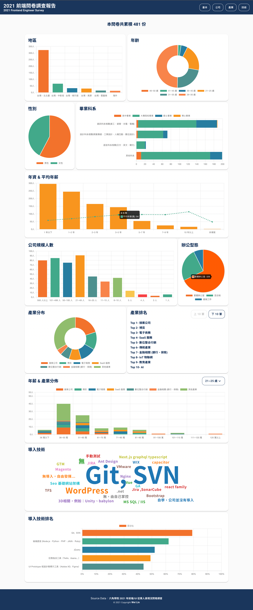

# 2021 FE-Survey
This site is developed by [Next.js](https://nextjs.org/) and [React.js](https://reactjs.org/), integrated [Chart.js](https://www.chartjs.org/docs/3.4.0/) for visualization and [MongoDB](https://www.mongodb.com/) as database.
### Description:
This website provides visualization chart to show survey results about Taiwanese frontend engineer work. The survey results data is from third-party API. [(hexschool/2021-ui-frontend-job)](https://github.com/hexschool/2021-ui-frontend-job)

### Demo link:


### Screenshots




### Resource 
- [rawData API URL](https://raw.githubusercontent.com/hexschool/2021-ui-frontend-job/master/frontend_data.json)
### Technologies 
- Framework: 
   - [Next.js](https://nextjs.org/) / [React.js](https://reactjs.org/)
- Frontend:  
   - HTML / CSS / JavaScript
- Database: 
   - [MongoDB](https://nextjs.org/) 


#### Dependencies
- [Material-UI](https://mui.com/)
- [Emotion](https://emotion.sh/docs/introduction)
- [Chart.js](https://www.chartjs.org/docs/3.4.0/)
- [mongoose](https://mongoosejs.com/)
- [swr](https://swr.vercel.app/)
- [next-connect](https://github.com/hoangvvo/next-connect)
- [react-chartjs-2](https://github.com/reactchartjs/react-chartjs-2)
- [react-d3-cloud](https://github.com/Yoctol/react-d3-cloud)
- ... ( see `package.json` for details )

#### Dev Dependencies
- [Husky](https://github.com/typicode/husky)
- [Prettier](https://prettier.io/)
- [ESlint](https://eslint.bootcss.com/)
- [commitlint](https://github.com/conventional-changelog/commitlint)
- [babel](https://babeljs.io/)
- ... ( see `package.json` for details )

### Folder structure
```
    .
    ├── asset                        # media assets, like icons, etc..
    ├── components                   # global components
    │    ├── BarChart.js             
    │    └── ...             
    ├── configs                      # Configs setting for some dependencies
    ├── constants                    # Consistent values
    ├── models                       # Mongo model initial settings 
    ├── docs                         # Documentation files 
    ├── page                         # Next.js page folder with built-in route support
    │    ├── api
    │    │   ├── surveys             # Next.js API 
    │    │   │   └── ...  
    │    │   ├── hello.page.js       # Test db server connection status
    │    │   └── seed.page.js        # Insert data from external API to mongoDB
    │    ├── components              # Utility components under home page
    │    │   ├── AdviceSection.js                 
    │    │   └── ...                  
    │    ├── index.page.js           # Home page file
    │    ├── index.style.js          # Home page style file
    │    └── ...   
    ├── public                       # Static files, like images, etc..
    ├── styles                       # Global styles for material-UI theme
    ├── utils                        # Tools and utilities
    └──  ...

```

### Setup
- Download or clone the repository
- Install dependencies
  ```bash
  yarn install
  ```
- [Install MongoDB locally](https://docs.mongodb.com/manual/installation/)
- Run the development server:
  ```bash
  yarn dev
  ```
- Open [http://localhost:3000/api/hello](http://localhost:3000/api/hello) to check application is connected to mongoDB
- Open [http://localhost:3000/api/seed](http://localhost:3000/api/seed) to insert data into mongoDB

- Open [http://localhost:3000](http://localhost:3000) with your browser to see the homePage.


### Author & Contributors
- Developer: [Wei Lin](https://github.com/WeiLin18)
- Source Data: Provided by [hexschool](https://github.com/hexschool/)


